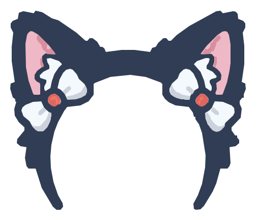

<p align="center">
  <a href="https://github.com/rishabhroyy/hokago"></a>
  <a href="https://github.com/rishabhroyy/hokago/releases"></a>
  <a href="https://github.com/rishabhroyy/hokago/actions/workflows/ci.yml"></a>
</p>

<p align="center">
  
</p>

<h3 align="center">Self-hosted media server for movies, TV and anime</h3>

> [!WARNING]
> The config dir holds the database — scan state, watch progress, users, artwork. Back it up. `scripts/backup.sh` snapshots postgres and the config dir.

> [!NOTE]
> hokago is pre-1.0. `latest` tracks the newest release; pin `HOKAGO_VERSION` in `docker-compose.yml` if you want to stay put.

## Links

- [Quick start](#quick-start)
- [Features](#features)
- [Configuration](#configuration)
- [Hardware acceleration](#hardware-acceleration)
- [Backup](#backup)
- [Star history](#star-history)
- [Contributors](#contributors)

## Quick start

```bash
wget -O docker-compose.yml https://raw.githubusercontent.com/rishabhroyy/hokago/main/docker-compose.yml
docker compose up -d
```

Open `http://localhost:3000`, create the admin account, then point hokago at your media. The compose file mounts three folders read-only into `/media/movies`, `/media/tv` and `/media/anime` — those fixed container paths are what the setup wizard records as library roots.

To upgrade: `docker compose pull && docker compose up -d`.

## Features

| Feature | Movies | TV | Anime |
| :------ | :----- | :- | :---- |
| Folder-based discovery, no database prep | Yes | Yes | Yes |
| Metadata from keyless APIs (TVmaze, AniList, Jikan) | Yes | Yes | Yes |
| Embedded artwork, NFO, posters, background art | Yes | Yes | Yes |
| Collections | Yes | Yes | Yes |
| Direct play | Yes | Yes | Yes |
| Remux to fragmented MP4 when needed | Yes | Yes | Yes |
| Transcoding (HLS) | Yes | Yes | Yes |
| Hardware acceleration (VAAPI, QSV, NVENC) | Yes | Yes | Yes |
| Subtitles, including embedded | Yes | Yes | Yes |
| Font extraction for styled subtitles | Yes | Yes | Yes |
| Trickplay scrubber previews | Yes | Yes | Yes |
| Watch state and continue watching | Yes | Yes | Yes |
| Multiuser with profiles | Yes | Yes | Yes |

## Configuration

Everything is set in `docker-compose.yml`; every value is an inline `${VAR:-default}`. There is no `.env` step.

| Variable | What it does | Default |
| :------- | :----------- | :------ |
| `HOKAGO_CONFIG_DIR` | config dir on the host (database, artwork, fonts, downloads) | `./data/config` |
| `MEDIA_MOVIES_PATH` | folder mounted at `/media/movies` | `./data/media/movies` |
| `MEDIA_TV_PATH` | folder mounted at `/media/tv` | `./data/media/tv` |
| `MEDIA_ANIME_PATH` | folder mounted at `/media/anime` | `./data/media/anime` |
| `HOKAGO_PORT` | web port | `3000` |
| `HOKAGO_VERSION` | image tag | `latest` |
| `POSTGRES_PASSWORD` | postgres password | `hokago` |
| `TZ` | timezone | `UTC` |

Holding more libraries? Add a mount line to the compose file and enter the matching target path in the wizard. The auth secret needs no setup — the first boot generates one and stores it in the database; `HOKAGO_JWT_SECRET` only overrides it (set it on multi-replica setups). Ports `5432` (postgres) and `6379` (valkey) are published for host-side admin tools; nothing internal depends on them and they can be removed for hardened deploys.

## Hardware acceleration

The amd64 image ships VAAPI, QSV and NVENC support. Two overlays enable it:

```bash
wget -O docker-compose.yml https://raw.githubusercontent.com/rishabhroyy/hokago/main/docker-compose.yml
wget -O hwaccel.yml https://raw.githubusercontent.com/rishabhroyy/hokago/main/infra/hwaccel.transcoding.yml
docker compose -f docker-compose.yml -f hwaccel.yml up -d
```

If no usable driver or `/dev/dri` is found at boot, hokago falls back to CPU. NVENC setups use `infra/hwaccel.nvenc.yml` instead. The arm64 image is CPU-only.

## Backup

`scripts/backup.sh` puts a postgres dump and a tar of the config dir into `./data/backups`. Restore: stop the containers, replace the config dir from the tar, drop and recreate the database, load the dump — the API re-runs migrations at boot.

`docker compose down` stops everything; deleting the config dir resets the server. Media folders are never touched.

## Star history

<a href="https://star-history.com/#rishabhroyy/hokago&Date">
  <picture>
    <source media="(prefers-color-scheme: dark)" srcset="https://api.star-history.com/svg?repos=rishabhroyy/hokago&type=Date&theme=dark" />
    
  </picture>
</a>

## Contributors

<a href="https://github.com/rishabhroyy"></a> [rishabhroyy](https://github.com/rishabhroyy)